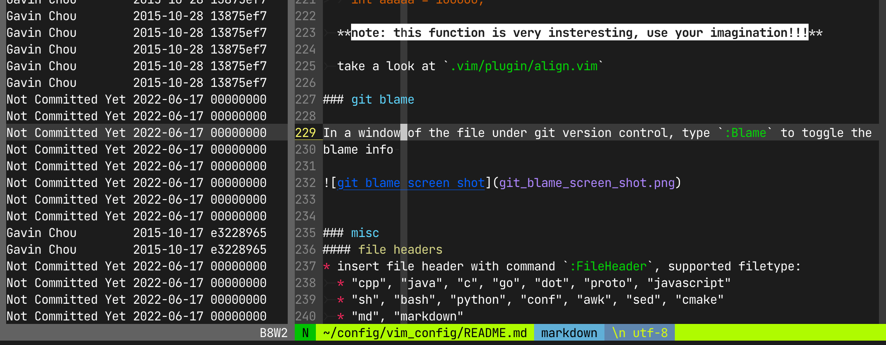
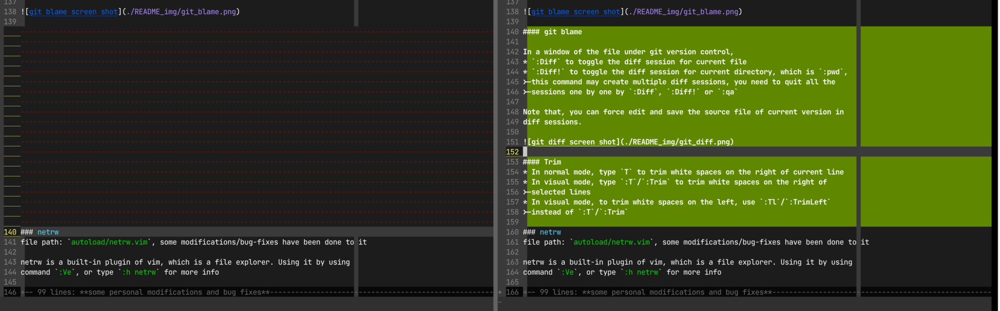

## gvim and vim configs/plugins

[TOC]

### overview
this config suite gets you the best experience with minimum plugins

### installation

1. to get the best experience of this config suite,
	 install [vim 7.4+](https://github.com/vim/vim.git)

2. download this vim config suite from github and

		git clone https://github.com/gavinchou/vim_config.git
		cd vim_config
		sh install.sh

### directory structure

	.
	├── .vim                                   --- .vim dir for vim customization
	│   ├── after
	│   │   └── ftplugin                       --- file type plugin
	│   │       ├── c.vim
	│   │       └── cpp.vim
	│   ├── autoload                           --- plugin
	│   │   ├── netrw.vim                      --- enhanced explorer, replace the vim-built-in netrw
	│   │   ├── omni                           --- omi complete plugin
	│   │   └── tagbar.vim                     --- taglist-alike outline view
	│   ├── colors                             --- themes/colors
	│   │   ├── Monokai.vim
	│   │   ├── Monokai_Gavin.vim              --- currently used customized theme
	│   │   └── Monokai_Gavin_Low_Contrast.vim
	│   ├── doc                                --- plugin docs
	│   │   ├── omnicppcomplete.txt
	│   │   └── taglist.txt
	│   ├── filetype.vim                       --- file type definition plugin
	│   ├── ftdetect                           --- file type detection plugin
	│   │   └── go.vim
	│   ├── indent                             --- customized indent plugin
	│   │   └── go.vim
	│   ├── plugin                             --- plugins written by me or collected
	│   │   ├── align.vim                      --- customized plugin for table alignment, like markdown table
	│   │   ├── findchar.vim                   --- find char with key `f` `F` in smartcase mode
	│   │   ├── statusline.vim                 --- customized statusline, pretty statusline
	│   │   ├── surround.vim                   --- surround something with key `F4`
	│   │   ├── tagbar.vim                     --- collected plugin `tagbar`
	│   │   ├── taglist.vim                    --- taglist, deprecated
	│   │   ├── template.vim                   --- customized file/code templates
	│   │   └── xterm-color-table.vim          --- collected plugin for adjusting colors
	│   ├── spell
	│   │   ├── en.utf-8.add
	│   │   ├── en.utf-8.add.spl
	│   │   └── spellsuggest.txt
	│   └── syntax                             --- customized syntax coloring for different types of file
	│       ├── alipaylog.vim
	│       ├── cpp.vim
	│       ├── go.vim
	│       ├── html.vim
	│       ├── markdown.vim
	│       ├── tagbar.vim
	│       └── test.vim
	├── .ycm_extra_conf.py                     --- YCM config file, not used
	├── _vimrc                                 --- main config/customization of vim, with functions/plugins/keymaps
	├── _vrapperrc                             --- vim config for eclipse plugin `vrapper`
	├── eclipse_color_monokai_gavin.xml        --- theme on eclipse
	├── install.sh                             --- installation script for Linux/MacOSx
	├── php_function_list.txt                  --- php function list for compeletion while editing php file
	└── plugin_collect                         --- not used, as a memo

### `_vimrc`
This configs general options of vim and some plugins

#### time date
* type `time` in normal mode to insert current time

		2015-10-17-Sat 14:46:02

* type `timelog` in normal mode to insert a time based log template, cursor will
	be set right behind 'tag: '

		## 2015-10-17-Sat 14:45:37
		tag: 

#### auto change IME

**change IME to Eng when user changes `insert mode` to `normal mode`
automatically**

This is useful for the users work with different IMEs, especially for users
who use Assian language.

MacOSx and Windows are supported.

##### enable auto-change-IME
* windows
	1. install the external util `change_ime_to_eng` for windows, which i offers
		in my repository, see this [link](mylink.com) for more details, contact me
	2. make shortcut link of it named `changeVimIme2Eng.lnk`, and put to
		 `%windir%`, say "C:\windows" as usual
	3. enjoy it

* mac os x
	1. `xkbswitch` for mac os x, refer to <https://github.com/myshov/xkbswitch-macosx>
	2. add the path of `xkbswitch` to system evn `PATH`
	3. enjoy it

##### note

only `txt` and `md` files invokes auto change ime feature, to enable this
feature for more filetypes just change the flowing line in `_vimrc`

		autocmd! InsertLeave *.txt,*.md call ChangeIme(g:autoChangeIme)

#### surround chars with given string
surround word under cursor or content selected with certain marks with, `F4` in
normal mode or visual mode

say, if a word `abc` is under cursor, in normal mode, press `F4`, a prompt will
ask for mark for surrounding, and, for example, inpput `(`, then `abc` will be
changed to `(abc)`

or, in visual mode, some chars are selected, say `abc def`, press `F4`, and
input the marks for surrounding, say `***`, `abc def` will be changed to
`***abc def***`

#### git blame

In a window of the file under git version control,
* `:Blame` to toggle the blame info window
* `:Blame!` to refresh the blame info window

#### git diff

In a window of the file under git version control,
* `:Diff` to toggle the diff session for current file
* `:Diff!` to toggle the diff session for current directory, which is `:pwd`,
	this command may create multiple diff sessions, you need to quit all the
	sessions one by one with `:Diff`, `:Diff!` or `:qa`

Note that, for convenience, you can force edit and save the source files of
current version in diff sessions.

To navigate in vim diff mode, use `]c` and `[c`,
check `:h diff` for more info about vim diff mode.

#### Trim
* In normal mode, type `T` to trim white spaces on the right of current line
* In visual mode, type `:T`/`:Trim` to trim white spaces on the right of
	selected lines
* In visual mode, to trim white spaces on the left, use `:Tl`/`:TrimLeft`
	instead of `:T`/`:Trim`

### netrw
file path: `autoload/netrw.vim`, some modifications/bug-fixes have been done to it

netrw is a built-in plugin of vim, which is a file explorer. Using it by using
command `:Ve`, or type `:h netrw` for more info

**some personal modifications and bug fixes**
* display file/dir full path under cursor
* fixed `s:NetrwTreeDir()`'s bugs of moving cursor around after calling it
* create file in current cursor folder with key `c`, if file is under current
	file, create file with the same parent fold of it
* auto change director when move cursor between different folder
* enhance preview with `<CR>`, always open file in preview window with `<CR>`
* auto change netrw cursor position to indicate current file (location) with switch
	g:netrw_indicate_current_file, default value is 1
* fix bug of messing up register `@*` and `@+`, which affect the system clipboard
* map 'yp' to copy full path in netrw list of the file under cursor

### tagbar
* fixed bugs when use tagbar with netrw, make tagbar process content window
* markdown support
* hilight whole tag line (maybe a switch can be added whether this function is
	enabled)

### statusline/tabline
file path: `plugin/statusline.vim`
* make statusline change color locally when mode changes
* tabline will change as statusline changes color (mode stimulated)

### findchar
* enhance `f`, `F`, `;` and `,` keys to case-insensitive when option
	`ignorecase` is on

### markdown
* fold contents with the same heading levels automatically

* 
	align markdown table with ranged based command `:Table`

	that is 

	1. select markdown tables
	2. input `:Table`, with which `:'<,'>Table` will appear

	example:

		before:

			header1|header2|header3
			-----|-----|-----
			aaa|b\|bb|cc
			dd|eeeee|ffffff

		after:

			header1|header2|header3
			-----  |-----  |-----
			aaa    |b\|bb  |cc
			dd     |eeeee  |ffffff

		note: this plugin has capability with '\|', skips escaped '|'

### code/text format
file path: `.vim/plugin/align.vim`
* as [previous](#markdownTable), align with given character is supported with
	ranged command `Align`
* `:Table` is actually alias of `:Align`
	
	example:

	orignal text:

		int a = 10;
		int aa = 100;
		int aaa = 1000;
		int aaaa = 10000;
		int aaaaa = 100000;

	select it and use command `:'<,'>Align =`

		int a     = 10;
		int aa    = 100;
		int aaa   = 1000;
		int aaaa  = 10000;
		int aaaaa = 100000;

	select it and use command `:'<,'>Align ;`
	
		int a = 10        ;
		int aa = 100      ;
		int aaa = 1000    ;
		int aaaa = 10000  ;
		int aaaaa = 100000;

	**note: this function is very insteresting, use your imagination!!!**

### misc
#### file headers/templates, `plugin/template.vim`
* insert file header with command `:FileHeader`, supported filetype:
	* "cpp", "java", "c", "go", "dot", "proto", "javascript"
	* "sh", "bash", "python", "conf", "awk", "sed", "cmake"
	* "md", "markdown"
